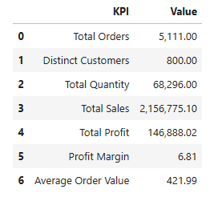
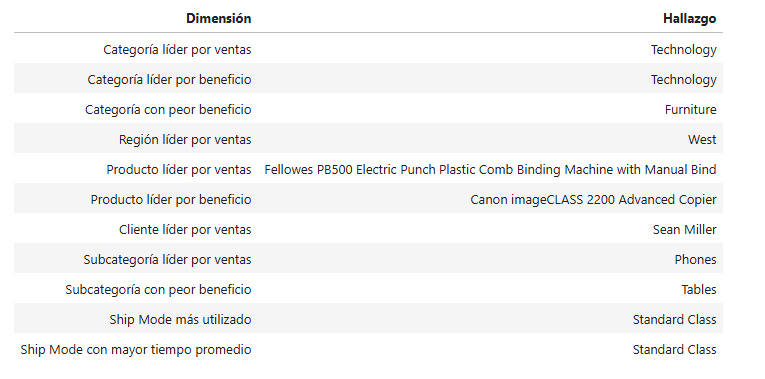

<div align="center">

# SuperStore Analytics

Proyecto integral de análisis de datos con el conjunto Superstore. Incluye limpieza de datos, diseño de bases de datos relacionales, automatización con SQL (procedimientos, triggers y auditoría) y análisis con Python.


</div>

---

El proyecto se divide en dos capas principales:

```text
                  SuperStore Analytics
                           │
             ┌─────────────┴─────────────┐
             │                           │
            SQL                        Python
             │                           │
   Ingeniería y análisis          EDA, estadística y
         de datos                   visualización
             │                           │
             └─────────────┬─────────────┘
                           │
                    Business Insights
```
---

## Objetivo

El proyecto busca transformar un dataset transaccional en una solución analítica reproducible capaz de responder preguntas como:

- ¿Cuánto vende el negocio y cuánto beneficio genera?
- ¿Cómo evolucionan ventas, beneficio y margen?
- ¿Qué categorías, subcategorías y productos tienen mejor desempeño?
- ¿Qué clientes generan mayor valor observado?
- ¿Dónde se concentra geográficamente el negocio?
- ¿Cómo se comporta la logística?
- ¿Qué relación existe entre descuentos y rentabilidad?
- ¿Qué tan concentradas están las ventas?
- ¿Qué patrones, outliers y segmentos pueden detectarse con Python?

El proyecto combina ingeniería de datos, modelado relacional, SQL analítico, auditoría, análisis exploratorio y visualización.

---

## Dataset

Para la base de datos, se utilizó el dataset [Superstore Sales | EDA, Outliers & Data Cleaning](https://www.kaggle.com/datasets/franciscozc/superstore-sales-eda-outliers-and-data-cleaning?resource=download) en la plataforma Kaggle.

Este archivo se peude encontrar en la ruta:

```text
data/raw/sales_superstore_raw.csv
```

El dataset original contiene **10,703 filas y 21 columnas** relacionadas con pedidos, clientes, productos, geografía, ventas, cantidades, descuentos, beneficios y logística.

Las variables principales son:

```text
Row ID,
Order ID, Order Date
Ship Date, Ship Mode
Customer ID, Customer Name
Segment
Country/Region, City, State/Province, Postal Code, Region
Product ID, Category, Sub-Category, Product Name
Sales, Quantity, Discount, Profit
```

Los registros del dataset están dentro del periodo de tiempo:

```text
2023-01-03 → 2026-12-30
```

---

## Estructura del repositorio

Se tiene la siguiente estructura del repositorio, en la que los datasets, tanto el original (en raw), el limpio (en clean) y los trabajados para el análisis (en views) se pueden acceder desde la carpeta `data`. Todo el proyecto relacionado a **SQL** y a **python** están en sus respectivas carpetas. 

```text
superstore-analytics/
│
├── data/
│   ├── raw/
│   │   └── sales_superstore_raw.csv
│   ├── clean
│   │   └── sales_superstore_clean.csv
│   │
│   └── views/
│       ├── vw_business_overview.csv
│       ├── vw_category_performance.csv
│       ├── vw_customer_performance.csv
│       ├── vw_geographic_performance.csv
│       ├── vw_monthly_performance.csv
│       ├── vw_order_summary.csv
│       ├── vw_product_performance.csv
│       ├── vw_sales_detail.csv
│       ├── vw_segment_performance.csv
│       ├── vw_ship_mode_performance.csv
│       └── vw_subcategory_performance.csv
│
├── sql/
│   ├── 1. ddl - data definition language/
│   ├── 2. dml - data manipulation language/
│   ├── 3. dql - data query language/
│   ├── 4. analysis/
│   ├── 5. procedures/
│   └── 6. triggers/
│
├── python/
│   ├── superstore_analysis.ipynb
│   └── superstore_analysis.html
│
├── images/
│
└── README.md
```

---

# Arquitectura

El flujo del proyecto completo es:

```text
      CSV original
           |
         MySQL
           |
Carga + limpieza + normalización
           |
    Modelo relacional
           |
    Views analíticas
           |
           ├───────── Analysis SQL
           │
           └──────── CSV de Views
                          |
                        Python
                          |
                    EDA + Estadística
                          |
                     Visualización
                          |
                       Insights
```

---

# SQL — Ingeniería y limpieza de datos

## Perfilado inicial

Antes de modificar los registros se revisó la calidad de los datos del dataset original, esto incluyó:

- cantidad de filas y columnas;
- valores NULL y cadenas vacías;
- cardinalidad;
- duplicados;
- formatos de fecha;
- consistencia de clientes;
- consistencia de productos;
- consistencia geográfica;
- rangos de `Discount`;
- coherencia entre `Order Date` y `Ship Date`.

Esto se hizo con la idea de detectar los problemas que existían en cada columna de datos antes de definir reglas para su transformación.

La lógica detrás de cada cambio es que debía haber información suficiente para poder modificar, transformar o recuperar los datos cuando fuese exclusivamente necesario, es decir, cuando hubiera un antescedente o una necesidad para hacerlo. En caso de los datos recuperados, se necesitaban otros datos para calcularlo o evidencia de otras partes del dataset para inducir el resultado, en estos casos, cuando no existía evidencia suficiente, se conservaba **`NULL`**. Esto evitó introducir información artificial en métricas económicas.

## Normalización

### Segment

Se normalizaron variantes y errores tipográficos de la columna `segments` hasta quedarse con los tres segmentos de la empresa:

<p align="center">
  
  
  <br>
  <em>Figura: Registros de la columna Segment antes y después de su normalización.</em>
</p>

### Category

Se corrigieron diferencias de formato relacionadas a espacios en blanco hasta terminar con las tres categorías de la empresa:

<p align="center">
  
  
  <br>
  <em>Figura: Registros de la columna Category antes y después de su normalización.</em>
</p>


### Sub-Category

Se validaron **17 subcategorías**:

<p align="center">
  
  
  <br>
  <em>Figura: Registros de la columna Subcategory.</em>
</p>

### Dates

`Order Date` y `Ship Date` tenían diferentes formatos de fecha. Se normalizaron a tipos de fecha consistentes.

<p align="center">
  
  
  <br>
  <em>Figura: Registros de la columna Order Date antes y después de su normalización.</em>
</p>

### Discount

Para los descuentos se detectó un valor anómalo ($5.5$) y se normalizó a $0.55$ interpretándolo como 55%. 

### IDs de clientes

Se detectó el caso de `Harry Olson`, asociado a cinco identificadores diferentes. Se estableció un identificador canónico:

```text
HO-15230
```

<p align="center">
  
  <br>
  <em>Figura: Duplicados en los IDs de clientes.</em>
</p>

### Geografía

Se detectó una inconsistencia para el código postal `92024`, asociado a dos ciudades. Se estableció como referencia canónica:

```text
United States + 92024 → Encinitas
```

<p align="center">
  
  <br>
  <em>Figura: Incosistencia de un código postal.</em>
</p>

### Duplicados

Se pasó de: **10,703 filas** a: **10,194 filas**, ya que se eliminaron **509 duplicados**. El análisis se realizó a nivel de registro completo y antes de determinadas normalizaciones.

<p align="center">
  
  <br>
  <em>Figura: Duplicados de registros en el dataset.</em>
</p>

### Valores faltantes

Los campos vacíos no se trataron todos de la misma manera. Se distinguieron:

```text
Dato observado
Dato recuperable con evidencia
Dato no recuperable
```

Los valores no recuperables permanecieron `NULL`.

#### Recuperación de Sales

Se calculó:

```text
Unit Price = Sales / Quantity
```

La referencia se construyó usando:

```text
Product ID + Discount
```

Cuando faltaba `Sales` pero existían una cantidad conocida y una referencia inequívoca:

```text
Sales = Quantity × Reference Unit Price
```

#### Recuperación de Quantity

Cuando faltaba `Quantity`:

```text
Quantity = Sales / Unit Price
```

Solo se aceptaron resultados prácticamente enteros.

#### Recuperación de Profit

Se utilizó:

```text
Profit Margin = Profit / Sales
```

y, cuando existía evidencia suficiente:

```text
Profit = Sales x Reference Profit Margin
```

Los valores ambiguos permanecieron como `NULL`.

---

# SQL — Modelo relacional

El modelo separó las entidades principales:

```text
customers
locations
ship_modes
categories
products
orders
order_details
```

Relaciones principales:

```text
CUSTOMERS  1 ───── N  ORDERS
LOCATIONS  1 ───── N  ORDERS
SHIP_MODES 1 ───── N  ORDERS
ORDERS     1 ───── N  ORDER_DETAILS
PRODUCTS   1 ───── N  ORDER_DETAILS
CATEGORIES 1 ───── N  PRODUCTS
```

Una decisión importante fue `Product ID`: algunos identificadores estaban reutilizados para productos diferentes. Por  lo que se utilizó `product_key` como clave sustituta para identificar de forma inequívoca cada producto real.


<p align="center">
  
  <br>
  <em>Figura: Modelo relacional del dataset. Fuente: MySQL Workbench.</em>
</p>

---

# SQL — Views analíticas

Las principales views fueron:

```text
vw_sales_detail
vw_order_summary
```

## `vw_sales_detail`

Esta view trabaja a nivel de `línea de pedido` y fue útil para analizar:

- Productos
- Categorías
- Subcategorías
- Descuentos
- Cantidades
- Ventas
- Beneficio

<p align="center">
  
  <br>
  <em>Figura: Porción de la vista sales_detail.</em>
</p>

## `vw_order_summary`

Esta view trabaja a nivel de `pedido` y fue útil para analizar:

- Pedidos
- Clientes
- Ticket
- Logística
- Ship Mode
- Ventas agregadas
- Beneficio agregado

<p align="center">
  
  <br>
  <em>Figura: Porción de la vista order_detail.</em>
</p>

Esta separación evita confundir líneas con pedidos.

# SQL — Análisis de negocio

La carpeta `sql/analysis/` contiene:

```text
01_business_overview.sql
02_annual_performance.sql
03_monthly_trends.sql
04_category_analysis.sql
05_subcategory_analysis.sql
06_product_analysis.sql
07_customer_analysis.sql
08_geographic_analysis.sql
09_logistics_analysis.sql
```

## Business Overview

Establece la línea base:

```text
Sales
Profit
Margin
Orders
Customers
Quantity
```

## Annual Performance

Compara:

```text
ventas
beneficio
margen
pedidos
crecimiento interanual
```

El crecimiento de ventas nunca se interpreta de forma aislada.

<p align="center">
  
  <br>
  <em>Figura: Parte de los indicadores correspondientes a cada año disponible en el conjunto de datos.</em>
</p>

## Monthly Trends

Analiza:

```text
estacionalidad
meses fuertes
meses débiles
variación intra-anual
```

<p align="center">
  
  <br>
  <em>Figura: Parte del ranking de mejores y peores meses según sus ventas conocidas, beneficio conocido y cantidad de pedidos.</em>
</p>

## Category Analysis

Compara:

```text
Furniture
Office Supplies
Technology
```
por ventas, beneficio y margen.

<p align="center">
  
  <br>
  <em>Figura: Impacto negativo de los descuentos frente a la rentabilidad de la categoría Furniture.</em>
</p>

## Subcategory Analysis

Profundiza en 17 subcategorías y permite detectar problemas ocultos dentro de una categoría.

<p align="center">
  
  <br>
  <em>Figura: Subcategorías con mayor proporción de líneas con pérdidas.</em>
</p>

## Product Analysis

Evalúa:

```text
ventas
beneficio
margen
pedidos
cantidad
descuentos
pérdidas
```

<p align="center">
  
  <br>
  <em>Figura: Productos con crecimiento de ventas y deterioro del margen.</em>
</p>

## Customer Analysis

Analiza el valor observado:

```text
ventas
pedidos
beneficio
frecuencia
ticket
margen
actividad
```

No se presenta ni se intenta hacer un CLV predictivo.

<p align="center">
  
  <br>
  <em>Figura: Cantidad de nuevos clientes incorporados cada mes durante el año 2023.</em>
</p>

## Geographic Analysis

Analiza:

```text
país
región
estado/provincia
ciudad
```

<p align="center">
  
  <br>
  <em>Figura: Estados con mayor volumen de ventas conocidas.</em>
</p>

## Logistics Analysis

Analiza:

```text
Ship Mode
Shipping Days
Same Day
1–2 días
3–4 días
5–7 días
8+ días
variabilidad
geografía
```

<p align="center">
  
  <br>
  <em>Figura: Parte de la comparación del desempeño de una misma modalidad de envío entre las distintas regiones del negocio.</em>
</p>

---

# SQL — Stored Procedures

Se desarrollaron seis procedimientos:

```text
01_sp_sales_summary_by_period.sql
02_sp_category_performance_by_period.sql
03_sp_top_products_by_period.sql
04_sp_top_customers_by_period.sql
05_sp_geographic_performance_by_period.sql
06_sp_logistics_performance_by_period.sql
```

Su objetivo es reutilizar análisis mediante parámetros como:

```text
p_start_date
p_end_date
p_top_n
p_category_name
```

Esto convierte consultas frecuentes en componentes reutilizables.

<p align="center">
  
  <br>
  <em>Figura: Información más relevante de la región West durante todo el periodo de cuatro años que incluye el dataset</em>
</p>

---

# SQL — Triggers y auditoría

La auditoría se implementó sobre:

```text
orders
order_details
```

Se crearon seis triggers para:

```text
INSERT
UPDATE
DELETE
```

y una tabla `audit_log` con:

```text
audit_id
table_name
record_key
action_type
changed_at
changed_by
connection_id
old_data
new_data
```

La semántica es:

```text
INSERT -> nuevo estado
UPDATE -> estado anterior + estado nuevo
DELETE -> estado eliminado
```

Cada uno de los estados se almacenan en JSON.

Además, se utilizó el operador `<=>` para evitar generar auditoría cuando un `UPDATE` no cambia realmente los valores.

La validación integral comprobó:

```text
existencia de triggers
estructura de audit_log
INSERT -> UPDATE -> DELETE
UPDATE sin cambios
coherencia global
```

Las pruebas se ejecutaron dentro de transacciones y terminaron con `ROLLBACK`.

<p align="center">
  
</p>
<p align="center">
  
  <br>
  <em>Figura: Actualización del estado de una venta.</em>
</p>

---

# Python — Análisis

Después de completar SQL, las views fueron exportadas a:

```text
data/views/
```

Python utiliza Google Colab y clona el repositorio:

<p align="center">
  
</p>

El notebook principal puede encontrarse en:

[](https://github.com/Edvard-Pichardo/superstore-analytics/blob/main/python/superstore_analytics.ipynb)

Las dos fuentes principales de datos son las vistas `vw_sales_detail.csv` y `vw_order_summary.csv`, aunque también se tiene acceso a las demás vistas enc ualquier momento. 

**Nota adicional:** El nombre de los productos contenidos en las vistas principales fue modificado debido a que, por problemas de importación, el interprete de python interpretaba mal algunas comillas dobles (") y comas (,) dentro de los nombres, por lo que fueron eliminadas de estos dos archivos. 

---

# Python — Preparación y validación

El notebook realiza:

```text
carga de CSV
inspección de estructura
conversión de tipos
revisión de NULL
cardinalidad
duplicados
validaciones temporales
validación de Discount
```

La vista de detalle se utiliza para análisis a nivel de línea y la de resumen para análisis a nivel de pedido.

---

# Python — Reproducción del análisis SQL

Python reconstruye parte de:

```text
Business Overview
Annual Performance
Monthly Trends
Seasonality
Category Analysis
Subcategory Analysis
Product Analysis
Customer Analysis
Geographic Analysis
Logistics Analysis
```

La intención no es repetir mecánicamente SQL, sino comprobar que pandas puede reconstruir los resultados desde las views. Agunos ejemplos de esto es la gráfica anual que nos muestra las ventas contra el beneficio. Se puede observar que no están correlacionadas, es decir, que mayores ventas no se traducen en mejores ganancias, al contrario, si otros aspectos de la empresa no están optimizados o hay errores en alguna parte de la cadena de venta, se pueden tener muchas ventas, pero obtener un beneficio, incluso, negativo. 

<p align="center">
  
  <br>
  <em>Figura: Gráfico de las ventas contra la ganacia por año.</em>
</p>

Otro de los gráficos importantes, por ejemplo, es el de estacionalidad por meses a través de los cuatro años que cubre el dataset. Se remarca que los meses **septiembre**, **noviembre** y **diciembre** representan una mayor densidad de ventas que, sumados, representan una proporción muy superior al 40% del volumen total anual.

Mientras que la baja actividad se concentra en el primer trimestre, siendo **enero** y **febrero** los de menor contribución. La caída de febrero es la más crítica, representando menos de la mitad del volumen de un mes promedio de la meseta central.

El resto del año se mantiene en estabilidad, exceptuando a **marzo** que experimenta un salto abrupto en el número de ventas. Fuera de ello, este periodo no presenta picos ni mesetas lo que sugiere que son las ventas generales o ventas base del negocio.

<p align="center">
  
  <br>
  <em>Figura: Ventas totales por mes del 2023 al 2026.</em>
</p>

---

# Python — Análisis exploratorio adicional

Python añade análisis que aprovechan mejor el entorno programático.

## Correlaciones

Se estudian:

```text
Sales
Quantity
Discount
Profit
Shipping Days
```

con especial interés en:

```text
Discount y Profit
```

La correlación se interpreta como asociación, no como causalidad.

<p align="center">
  
  <br>
  <em>Figura: Matriz de correlación entre las variables más importantes del dataset.</em>
</p>

## Discount vs Profit

Se utiliza un scatter plot y bandas de descuento:

```text
0–10%
10–20%
20–30%
30–40%
40–50%
50%+
```

para estudiar cambios de rentabilidad.

<p align="center">
  
  <br>
  <em>Figura: Tabla del profit por banda de descuentos.</em>
</p>


## Distribuciones

Se analizan las distribuciones de:

```text
Sales
Profit
Quantity
Discount
Shipping Days
```

<p align="center">
  
  <br>
  <em>Figura: Distribución de las variables principales.</em>
</p>

## Outliers

Se utiliza IQR:

```text
Q1 - 1.5 × IQR
Q3 + 1.5 × IQR
```

Los outliers no se eliminan automáticamente.

## Cuadrantes de productos

Se analiza:

```text
Sales vs Profit
```

con cuatro perfiles:

```text
High Sales / High Profit
High Sales / Low Profit
Low Sales / High Profit
Low Sales / Low Profit
```

<p align="center">
  
  <br>
  <em>Figura: Cuadrantes de sales vs profit.</em>
</p>

## RFM

Se construye una segmentación descriptiva de clientes:

```text
Recency
Frequency
Monetary
```

RFM se utiliza como análisis descriptivo y no como CLV predictivo.

<p align="center">
  
  <br>
  <em>Figura: Análisis RFM de la base de clientes.</em>
</p>

---

# Python — Resultados destacados

La implementación actual muestra:

```text
10,194 líneas de pedido
5,113 pedidos
800 clientes
1,894 productos
3 categorías
17 subcategorías
```

Valores globales aproximados:

<p align="center">
  
</p>

Algunos detalles importantes son:

<p align="center">
  
  <br>
  <em>Figura: Resumen ejecutivo sobre los hallazgos por dimensión.</em>
</p>

Estos resultados son ejemplos de la clase de insights que el proyecto permite obtener; las conclusiones finales deben basarse en las tablas y gráficos completos.

---

# Ejecución del proyecto

## SQL

Orden general:

```text
1. Crear esquema
2. Crear tablas
3. Crear PK/FK/restricciones
4. Cargar datos
5. Limpiar / normalizar
6. Validar datos
7. Crear views
8. Ejecutar analysis
9. Crear procedures
10. Crear audit_log
11. Crear triggers
12. Ejecutar validación integral
```

En particular, dentro de la carpeta `sql/` se encuentran las carpetas enumeradas, así como sus archivos internos, por orden de ejecución para que no haya ningún problema al momento de replicar este proyecto. 

De esta forma, dentro de `analysis`:

```text
01_business_overview
02_annual_performance
03_monthly_trends
04_category_analysis
05_subcategory_analysis
06_product_analysis
07_customer_analysis
08_geographic_analysis
09_logistics_analysis
```

Dentro de `procedures`:

```text
01 → 02 → 03 → 04 → 05 → 06
```

Dentro de `triggers`:

```text
audit_log
|
triggers 01–06
|
07_validate_audit_system
```

## Python

```text
1. Abrir Google Colab
2. Clonar el repositorio
3. Definir RUTA_BASE
4. Detectar y cargar CSV
5. Validar estructura
6. Ejecutar análisis
7. Revisar visualizaciones
```

---

# Tecnologías utilizadas

```text
MySQL 8
SQL
MySQL Workbench / VS Code Database Client
Python
pandas
NumPy
matplotlib
Jupyter Notebook
Google Colab
Git
GitHub
```

---

# Conclusión

SuperStore Analytics parte de un dataset transaccional con problemas reales de calidad y lo convierte en una solución analítica estructurada.

La capa SQL se encarga de:

```text
Carga
Limpieza
Normalización
Recuperación de datos
Modelado relacional
Views
Análisis
Procedimientos
Auditoría
Validación
```

La capa Python utiliza las views resultantes para:

```text
Reproducir análisis
Explorar datos
Estudiar relaciones
Detectar outliers
Medir concentración
Segmentar clientes
Crear visualizaciones
Validar resultados
```

El resultado es un flujo completo que conecta ingeniería de datos con análisis de negocio:

```text
Datos de origen
      |
     SQL
      |
Views analíticas
      |
    Python
      |
   Insights
```

---

# Licencia

Este proyecto se distribuye bajo la licencia **MIT**.

Consulta el archivo **LICENSE** para más información.


# Autor

## Edvard Pichardo

**Licenciado en Física**  
Universidad Nacional Autónoma de México (UNAM)

---
