<div align="center">

# SuperStore Analytics

**Del CSV crudo al dashboard:** limpieza de datos, modelo relacional en MySQL, SQL analítico con automatización y auditoría, EDA en Python y un dashboard interactivo en Power BI.


[](https://github.com/Edvard-Pichardo/superstore-analytics/blob/main/powerbi/superstore_dashboard.pdf)
[](https://colab.research.google.com/github/Edvard-Pichardo/superstore-analytics/blob/main/python/superstore_analytics.ipynb)

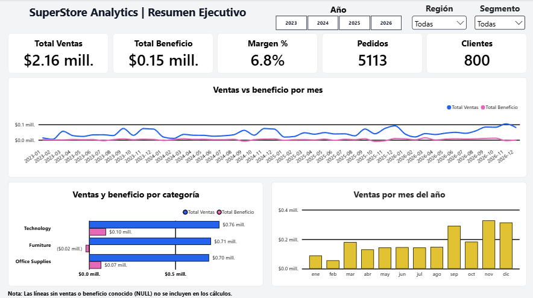

</div>

---

## Contenido

- [Resumen](#resumen)
- [Hallazgos clave](#hallazgos-clave)
- [Qué demuestra este proyecto](#qué-demuestra-este-proyecto)
- [Arquitectura](#arquitectura)
- [Dataset](#dataset)
- [Estructura del repositorio](#estructura-del-repositorio)
- SQL: [Limpieza](#sql-limpieza-y-normalización) · [Modelo relacional](#sql-modelo-relacional) · [Views](#sql-views-analíticas) · [Análisis](#sql-análisis-de-negocio) · [Procedures](#sql-stored-procedures) · [Triggers y auditoría](#sql-triggers-y-auditoría)
- [Python: análisis](#python-análisis)
- [Power BI: dashboard](#power-bi-dashboard)
- [Cómo reproducir el proyecto](#cómo-reproducir-el-proyecto)
- [Decisiones de diseño y limitaciones](#decisiones-de-diseño-y-limitaciones)
- [Tecnologías](#tecnologías)
- [Autor](#autor)

---

## Resumen

Este proyecto transforma un dataset transaccional con problemas reales de calidad en una solución analítica reproducible. Parte de un CSV crudo de **10,703 filas**, lo limpia y lo normaliza en MySQL, lo modela como base de datos relacional, expone views analíticas y automatiza consultas con procedimientos almacenados, triggers y una tabla de auditoría. Después, Python (pandas) reproduce y amplía el análisis, y Power BI lo presenta en un dashboard interactivo.

Preguntas de negocio que responde:

- ¿Cuánto vende el negocio y cuánto beneficio genera? ¿Cómo evolucionan ventas, beneficio y margen?
- ¿Qué categorías, subcategorías y productos tienen mejor (y peor) desempeño?
- ¿Qué clientes generan mayor valor observado?
- ¿Dónde se concentra geográficamente el negocio y cómo se comporta la logística?
- ¿Qué relación existe entre descuentos y rentabilidad?
- ¿Qué patrones, outliers y segmentos pueden detectarse con Python?

**Indicadores globales** (datos ya limpios, calculados sobre valores conocidos):

| Ventas | Beneficio | Margen | Unidades | Ticket promedio |
|:---:|:---:|:---:|:---:|:---:|
| $2,156,775 | $146,888 | 6.81 % | 68,296 | $421.99 |

| Líneas de pedido | Pedidos | Clientes | Productos | Categorías | Subcategorías |
|:---:|:---:|:---:|:---:|:---:|:---:|
| 10,194 | 5,113 <sup>1</sup> | 800 | 1,894 | 3 | 17 |

<sup>1</sup> `vw_order_summary` tiene 5,113 pedidos y 5,111 `order_id` distintos, (ver [limitaciones](#decisiones-de-diseño-y-limitaciones)). El ticket promedio usa los 5,111 `order_id`.

---

## Hallazgos clave

- **El negocio es poco rentable y depende de pocas líneas.** El margen global es de solo 6.81 %. *Technology* ($97.6k) y *Office Supplies* ($70.2k) generan todo el beneficio, mientras que *Furniture* pierde $20.9k (margen −2.96 %) pese a vender casi lo mismo que *Technology*.
- **Los descuentos altos destruyen rentabilidad.** Con 0–10 % de descuento el margen es de 25.5 %; con 10–20 % cae a 1.1 %; desde 20 % es negativo, y con 50 % o más se pierden unos $0.68 por cada dólar vendido (margen −68.1 %). La correlación descuento–beneficio es débil (−0.12), pero es la más negativa de la matriz.
- **Vender más no implica ganar más.** En 2025 las ventas subieron 23.9 %, pero el beneficio cayó 46.8 % (margen de 3.14 %). En 2026 el margen se recuperó a 9.97 % y el beneficio se multiplicó casi por cuatro.
- **Estacionalidad marcada, pero el mes que más vende casi no deja beneficio.** Septiembre, noviembre y diciembre concentran el 43.3 % de las ventas. Noviembre vende $327.5k y deja solo $2.2k de beneficio (0.68 %). Febrero es el más débil al tener menos de la mitad de un mes típico.
- **Las pérdidas se concentran en pocas subcategorías y productos.** Tables (−$25.7k), Bookcases (−$14.0k), Machines (−$9.3k), Binders (−$5.9k) y Supplies (−$1.2k) suman −$56.1k. Un solo producto, el Ibico EPK-21, pierde $21.0k (≈14 % del beneficio total). En contraste, *Copiers* opera con 48 % de margen.
- **Los clientes que más venden no siempre son rentables.** El cliente con más ventas (Sean Miller, $25.0k) tiene pérdidas de $2.0k.
- **Geografía.** El 98.7 % de las ventas está en EE. UU., y California y Nueva York sostienen el beneficio. Texas, Illinois, Pennsylvania, Ohio y Carolina del Norte, entre otros, venden con margen negativo. *West* lidera en ventas, pero *East* genera más beneficio (margen de 8.24 % contra 6.33 %).
- **Logística.** *Standard Class* concentra el 56.9 % de los pedidos con 8.0 % de margen. *Same Day* pierde dinero en East (−4.6 %) y South (−8.5 %), y *Second Class* en West (−3.8 %). Los días de envío son casi iguales entre regiones para un mismo modo, así que el problema es de rentabilidad, no de velocidad.

---

## Qué demuestra este proyecto

| Área | Evidencia en el repositorio |
|---|---|
| **Calidad de datos** | Perfilado inicial, normalización, eliminación de 509 duplicados, recuperación de datos solo con evidencia y `NULL` cuando hay ambigüedad |
| **Modelado relacional** | 7 tablas con PK/FK y restricciones; resolución de IDs de producto reutilizados con `product_key` |
| **SQL analítico** | 9 scripts de análisis de negocio y 11 views exportadas |
| **SQL programable** | 6 stored procedures parametrizados, 6 triggers y `audit_log` con estados en JSON |
| **Validación** | Pruebas de triggers dentro de transacciones con `ROLLBACK` |
| **Python** | EDA con pandas: análisis temporal, correlaciones, outliers (IQR), cuadrantes de productos y RFM |
| **BI** | Modelo de datos en Power BI con tabla de calendario, medidas en DAX y dashboard de 4 páginas |
| **Reproducibilidad** | Scripts numerados en orden de ejecución y notebook ejecutable en Google Colab |

---

## Arquitectura

El proyecto tiene tres capas que comparten las mismas views como fuente de verdad:

```text
                               SuperStore Analytics
                                         │
             ┌───────────────────────────┴──────────────────────────┐
             │                           │                          │
            SQL                        Python                    Power BI
             │                           │                          │
   Ingeniería y análisis          EDA, estadística y       Diseño y presentación
         de datos                   visualización          mediante un dashboard
             │                           │                          │
             └───────────────────────────┬──────────────────────────┘
                                         │
                                 Business Insights
```

Flujo de datos:

```text
      CSV original
           │
         MySQL
           │
Carga + limpieza + normalización
           │
    Modelo relacional
           │
    Views analíticas
           │
           ├───────── Análisis SQL
           │
           └──────── CSV de views
                          │
                        Python                      Power BI
                          │                             │
                    EDA + estadística          Dashboard interactivo
                          │                             │
                     Visualización              Exploración visual
                          │                             │
                          └────────── Insights ─────────┘
```

---

## Dataset

| | |
|---|---|
| **Fuente** | [Superstore Sales \| EDA, Outliers & Data Cleaning](https://www.kaggle.com/datasets/franciscozc/superstore-sales-eda-outliers-and-data-cleaning?resource=download) (Kaggle) |
| **Archivo** | `data/raw/sales_superstore_raw.csv` |
| **Tamaño original** | 10,703 filas × 21 columnas |
| **Periodo** | 2023-01-03 → 2026-12-30 |
| **Naturaleza** | Dataset público con fines de práctica; no corresponde a una empresa real |

Variables principales:

```text
Row ID
Order ID, Order Date, Ship Date, Ship Mode
Customer ID, Customer Name, Segment
Country/Region, City, State/Province, Postal Code, Region
Product ID, Category, Sub-Category, Product Name
Sales, Quantity, Discount, Profit
```

---

## Estructura del repositorio

Los datasets original (`raw`), limpio (`clean`) y las views para análisis (`views`) están en `data/`. Todo lo de **SQL**, **Python** y **Power BI** vive en su propia carpeta.

```text
superstore-analytics/
│
├── data/
│   ├── raw/
│   │   └── sales_superstore_raw.csv
│   ├── clean/
│   │   └── sales_superstore_clean.csv
│   └── views/
│       ├── vw_business_overview.csv
│       ├── vw_category_performance.csv
│       ├── vw_customer_performance.csv
│       ├── vw_geographic_performance.csv
│       ├── vw_monthly_performance.csv
│       ├── vw_order_summary.csv
│       ├── vw_product_performance.csv
│       ├── vw_sales_detail.csv
│       ├── vw_segment_performance.csv
│       ├── vw_ship_mode_performance.csv
│       └── vw_subcategory_performance.csv
│
├── sql/
│   ├── 1. ddl - data definition language/
│   ├── 2. dml - data manipulation language/
│   ├── 3. dql - data query language/
│   ├── 4. analysis/
│   ├── 5. procedures/
│   └── 6. triggers/
│
├── python/
│   ├── superstore_analytics.ipynb
│   └── superstore_analytics.html
│
├── powerbi/
│   ├── superstore_dashboard.pbix
│   └── superstore_dashboard.pdf
│
├── images/
├── LICENSE
└── README.md
```

---

## SQL: limpieza y normalización

Toda la limpieza se hace sobre una tabla de *staging* (`stg_sales`), con los scripts `04_data_cleaning_1` a `04_data_cleaning_7`. Las modificaciones se ejecutan, en general, dentro de transacciones y van precedidas de una consulta de validación.

### Perfilado inicial

Antes de modificar cualquier registro se revisó la calidad del dataset original:

- cantidad de filas y columnas;
- valores `NULL` y cadenas vacías;
- cardinalidad y duplicados;
- formatos de fecha y coherencia entre `Order Date` y `Ship Date`;
- consistencia de clientes, productos, pedidos y geografía;
- rangos de `Discount`.

**Criterio general:** un dato solo se modifica o recupera cuando existe evidencia suficiente en otras partes del dataset. Si no la hay, se conserva como `NULL`. Así se evita introducir información artificial en las métricas económicas.

### Resumen de problemas encontrados

| Columna / tema | Problema detectado | Tratamiento |
|---|---|---|
| Duplicados | Registros completos repetidos | 10,703 → **10,194** filas (**509** eliminados) |
| Texto | Espacios sobrantes y cadenas vacías | `TRIM` + `NULLIF`: las cadenas vacías pasan a `NULL` |
| `Segment` | Variantes y errores tipográficos (por ejemplo `consumr`, `corp.`, `homeoffice`) | Normalizado a 3 segmentos: Consumer, Corporate y Home Office |
| `Category` | Diferencias de formato por espacios en blanco | Normalizado a las 3 categorías del negocio |
| `Sub-Category` | Validación de valores | 17 subcategorías confirmadas |
| `Order Date` | 5 formatos de fecha distintos | Convertidos a `YYYY-MM-DD` con `REGEXP` y `STR_TO_DATE` |
| `Ship Date` | Formato ya consistente; sin envíos anteriores al pedido | Validado; días de envío de 0 a 11 (promedio 3.96) |
| `Discount` | 101 registros con el valor anómalo `5.5` | Normalizado a `0.55` (55 %), interpretándolo como error de escala |
| `Ship Mode` | 1,019 valores vacíos | 739 recuperados desde otra línea del mismo pedido; 280 permanecen `NULL` |
| `Sales` | 1,529 valores vacíos | 1,061 recuperados; 468 permanecen `NULL` |
| `Quantity` | 509 valores vacíos | 321 recuperados; 188 permanecen `NULL` |
| `Profit` | 1,019 valores vacíos | 521 recuperados; 498 permanecen `NULL` |
| `Product ID` | 32 IDs compartidos por productos distintos | ID nuevo con sufijo (`-1`, `-2`…) para los menos frecuentes y clave sustituta `product_key` en el modelo |
| `Customer ID` | `Harry Olson` con 5 identificadores distintos | ID canónico `HO-15230` (el de primera aparición) |
| Geografía | Código postal `92024` asociado a `Encinitas` y `San Diego` | Referencia canónica `United States + 92024 → Encinitas` (Encinitas pertenece al condado de San Diego) |
| Pedidos | 2 `order_id` con dos ciudades y dos códigos postales dentro del mismo pedido | Se conservan sin modificar: no hay evidencia para decidir cuál es correcto |

Antes de la recuperación, solo 7,420 de 10,194 registros (72.8 %) tenían `Sales`, `Quantity` y `Profit` completos. En 8 registros faltaban las tres métricas y no había forma de recuperar ninguna.

### Valores faltantes

Los campos vacíos no se trataron todos igual. Se distinguieron tres casos:

```text
Dato observado
Dato recuperable con evidencia
Dato no recuperable  ->  permanece NULL
```

**Ship Mode.** Se recupera desde otra línea del mismo `order_id`, solo cuando el pedido tiene un único modo de envío conocido.

**Sales.** Se calcula un precio unitario de referencia por `Product ID + Discount`, aceptándolo únicamente cuando esa combinación tiene un solo precio unitario en todo el dataset:

```text
Unit Price = Sales / Quantity
Sales      = Quantity × Reference Unit Price
```

**Quantity.** Se recupera con el mismo precio de referencia y solo se acepta un resultado positivo y prácticamente entero:

```text
Quantity = Sales / Unit Price
```

**Profit.** Se usa un margen de referencia por `Product ID + Discount`, aceptado solo si hay al menos dos registros completos y todos comparten el mismo margen. Los casos ambiguos quedan como `NULL`:

```text
Profit Margin = Profit / Sales
Profit        = Sales × Reference Profit Margin
```

<details>
<summary><b>Ver evidencia (capturas de validación y normalización)</b></summary>

<br>

**Segment**

<p align="center">
  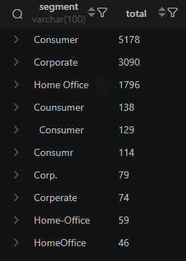
  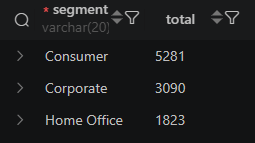
  <br>
  <em>Figura: Registros de la columna Segment antes y después de su normalización.</em>
</p>

**Category**

<p align="center">
  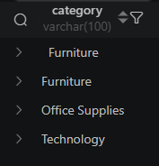
  
  <br>
  <em>Figura: Registros de la columna Category antes y después de su normalización.</em>
</p>

**Sub-Category**

<p align="center">
  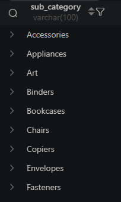
  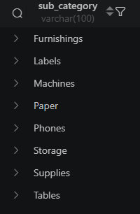
  <br>
  <em>Figura: Registros de la columna Sub-Category (17 valores).</em>
</p>

**Fechas**

<p align="center">
  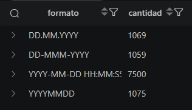
  
  <br>
  <em>Figura: Registros de la columna Order Date antes y después de su normalización.</em>
</p>

**IDs de clientes**

<p align="center">
  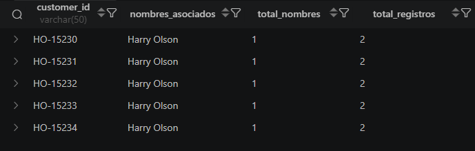
  <br>
  <em>Figura: Duplicados en los IDs de clientes.</em>
</p>

**Geografía**

<p align="center">
  
  <br>
  <em>Figura: Inconsistencia de un código postal.</em>
</p>

**Duplicados**

<p align="center">
  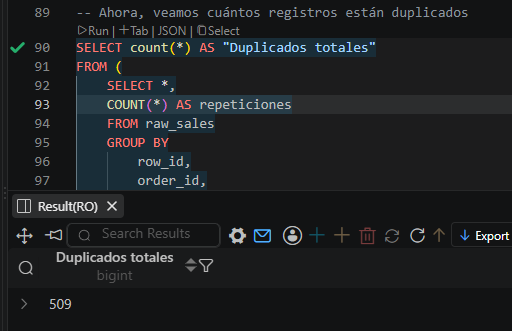
  <br>
  <em>Figura: Duplicados de registros en el dataset.</em>
</p>

</details>

### Verificación final

El último script (`04_data_cleaning_7`) comprueba en una sola consulta el volumen, la unicidad de `Row ID`, los identificadores sin `NULL`, las fechas válidas, los envíos posteriores al pedido, los valores válidos de segmento, categoría y modo de envío, los descuentos en rango, las cantidades enteras y positivas, y la ausencia de filas duplicadas.

---

## SQL: modelo relacional

El modelo separa las entidades principales:

```text
customers · locations · ship_modes · categories · products · orders · order_details
```

Relaciones:

```text
CUSTOMERS  1 ───── N  ORDERS
LOCATIONS  1 ───── N  ORDERS
SHIP_MODES 1 ───── N  ORDERS
ORDERS     1 ───── N  ORDER_DETAILS
PRODUCTS   1 ───── N  ORDER_DETAILS
CATEGORIES 1 ───── N  PRODUCTS
```

**Decisión importante:** algunos `Product ID` estaban reutilizados para productos diferentes. Tras reasignarles un ID único en *staging*, el modelo usa `product_key`, una clave sustituta que identifica de forma inequívoca a cada producto real. Todos los análisis agrupan por `product_key`.

<p align="center">
  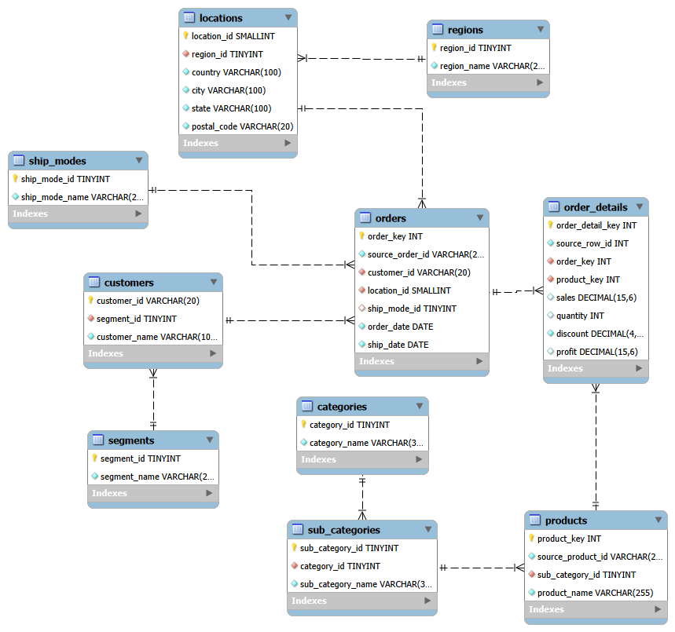
  <br>
  <em>Figura: Modelo relacional del dataset. Fuente: MySQL Workbench.</em>
</p>

---

## SQL: views analíticas

Hay dos views principales, con distinto nivel de detalle. Separarlas evita confundir líneas con pedidos.

| View | Nivel | Útil para analizar |
|---|---|---|
| `vw_sales_detail` | Línea de pedido | Productos, categorías, subcategorías, descuentos, cantidades, ventas y beneficio |
| `vw_order_summary` | Pedido | Pedidos, clientes, ticket, logística, modo de envío, ventas y beneficio agregados |

<p align="center">
  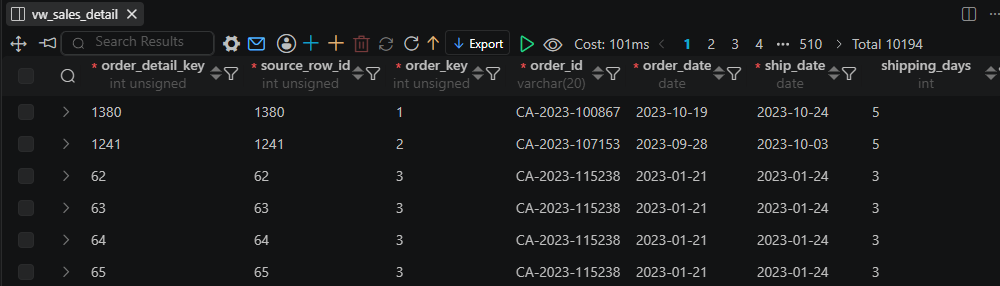
  <br>
  <em>Figura: Porción de la view <code>vw_sales_detail</code>.</em>
</p>

<p align="center">
  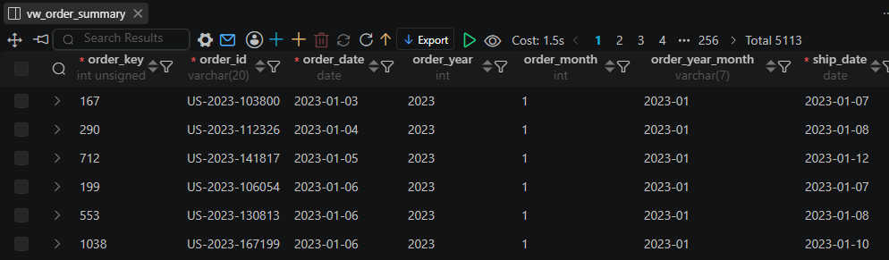
  <br>
  <em>Figura: Porción de la view <code>vw_order_summary</code>.</em>
</p>

Además de estas dos, se exportan otras 9 views agregadas a `data/views/`.

---

## SQL: análisis de negocio

La carpeta `sql/4. analysis/` contiene nueve scripts:

| Script | Qué analiza |
|---|---|
| `01_business_overview` | Línea base: periodo, pedidos, clientes, productos, ventas, beneficio, margen y logística, más indicadores de **cobertura de datos** (porcentaje de ventas, cantidad y beneficio conocidos, y pedidos con valores desconocidos) |
| `02_annual_performance` | Ventas, beneficio, margen, pedidos y crecimiento interanual (el crecimiento de ventas nunca se interpreta de forma aislada) |
| `03_monthly_trends` | Estacionalidad, meses fuertes y débiles, variación intra-anual |
| `04_category_analysis` | *Furniture*, *Office Supplies* y *Technology* por ventas, beneficio y margen |
| `05_subcategory_analysis` | 17 subcategorías; permite detectar problemas ocultos dentro de una categoría |
| `06_product_analysis` | Ventas, beneficio, margen, pedidos, cantidad, descuentos y pérdidas por producto |
| `07_customer_analysis` | Valor observado: ventas, pedidos, beneficio, frecuencia, ticket, margen y actividad (sin CLV predictivo) |
| `08_geographic_analysis` | País, región, estado/provincia y ciudad |
| `09_logistics_analysis` | Modo de envío y días de envío (Same Day, 1–2, 3–4, 5–7, 8+), variabilidad y geografía |

<details>
<summary><b>Ver resultados de cada análisis</b></summary>

<br>

<p align="center">
  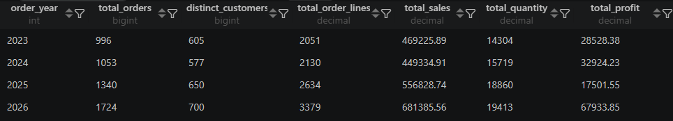
  <br>
  <em>Figura: Parte de los indicadores de cada año disponible en el dataset.</em>
</p>

<p align="center">
  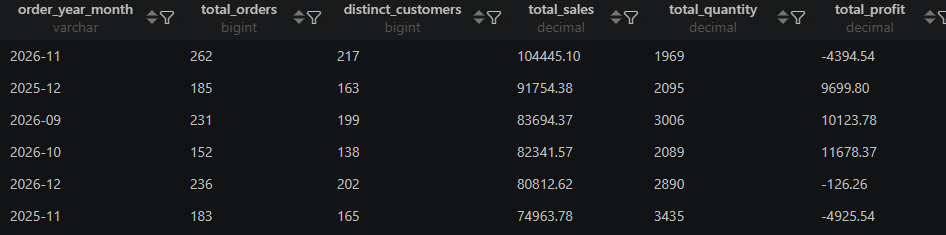
  <br>
  <em>Figura: Parte del ranking de mejores y peores meses según ventas conocidas, beneficio conocido y cantidad de pedidos.</em>
</p>

<p align="center">
  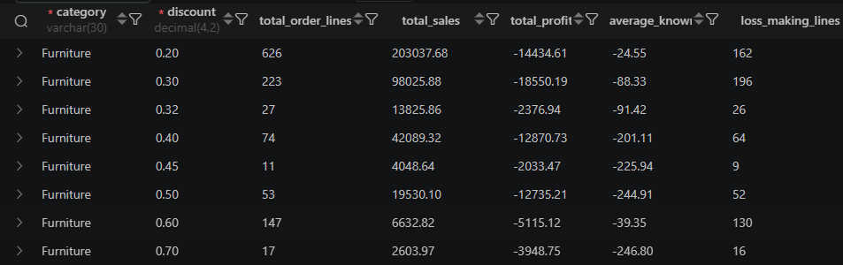
  <br>
  <em>Figura: Impacto negativo de los descuentos frente a la rentabilidad de la categoría Furniture.</em>
</p>

<p align="center">
  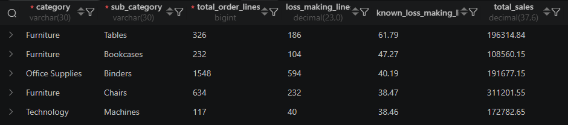
  <br>
  <em>Figura: Subcategorías con mayor proporción de líneas con pérdidas.</em>
</p>

<p align="center">
  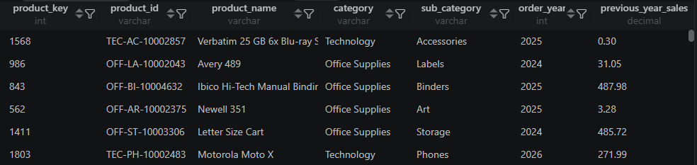
  <br>
  <em>Figura: Productos con crecimiento de ventas y deterioro del margen.</em>
</p>

<p align="center">
  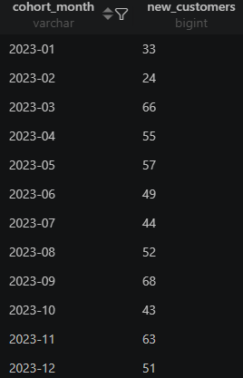
  <br>
  <em>Figura: Cantidad de nuevos clientes incorporados cada mes durante 2023.</em>
</p>

<p align="center">
  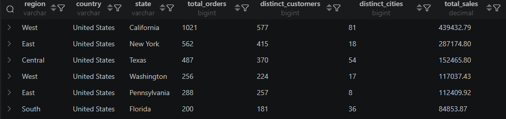
  <br>
  <em>Figura: Estados con mayor volumen de ventas conocidas.</em>
</p>

<!-- OJO: antes esta figura usaba 09_an_geo.png (la misma de geografía). Verifica el nombre real del archivo de logística. -->
<p align="center">
  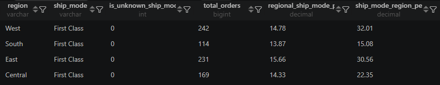
  <br>
  <em>Figura: Comparación del desempeño de una misma modalidad de envío entre las distintas regiones.</em>
</p>

</details>

---

## SQL: stored procedures

Seis procedimientos convierten consultas frecuentes en componentes reutilizables:

```text
01_sp_sales_summary_by_period.sql
02_sp_category_performance_by_period.sql
03_sp_top_products_by_period.sql
04_sp_top_customers_by_period.sql
05_sp_geographic_performance_by_period.sql
06_sp_logistics_performance_by_period.sql
```

Parámetros habituales: `p_start_date`, `p_end_date`, `p_top_n`, `p_category_name`.

<p align="center">
  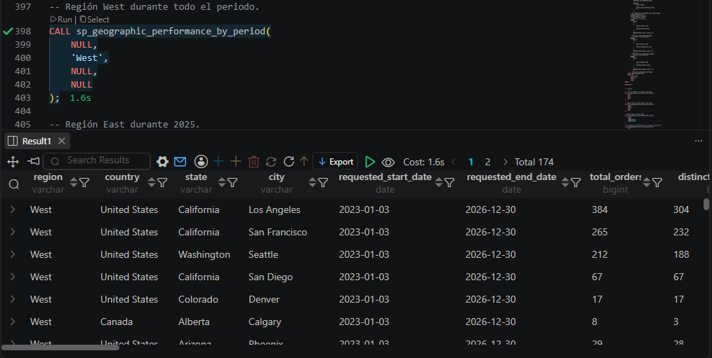
  <br>
  <em>Figura: Información más relevante de la región West durante los cuatro años del dataset.</em>
</p>

---

## SQL: triggers y auditoría

La auditoría cubre las tablas `orders` y `order_details` con **seis triggers** (`INSERT`, `UPDATE`, `DELETE` en cada tabla) y una tabla `audit_log`:

```text
audit_id · table_name · record_key · action_type · changed_at
changed_by · connection_id · old_data · new_data
```

Qué se guarda en cada operación (los estados se almacenan en JSON):

| Operación | Contenido |
|---|---|
| `INSERT` | Estado nuevo |
| `UPDATE` | Estado anterior + estado nuevo |
| `DELETE` | Estado eliminado |

Se usa el operador `<=>` (comparación segura con `NULL`) para no registrar auditoría cuando un `UPDATE` no cambia realmente ningún valor.

**Validación integral.** Comprueba la existencia de los triggers, la estructura de `audit_log`, el ciclo `INSERT → UPDATE → DELETE`, los `UPDATE` sin cambios y la coherencia global. Todas las pruebas se ejecutan dentro de transacciones y terminan con `ROLLBACK`, por lo que no alteran los datos.

<p align="center">
  
</p>
<p align="center">
  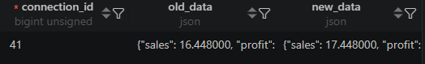
  <br>
  <em>Figura: Actualización del estado de una venta registrada en <code>audit_log</code>.</em>
</p>

---

## Python: análisis

Tras completar la parte de SQL, las views se exportaron a `data/views/`. El notebook corre en Google Colab, clona el repositorio y trabaja principalmente con dos archivos: `vw_sales_detail.csv` (análisis a nivel de línea, 10,194 filas) y `vw_order_summary.csv` (análisis a nivel de pedido, 5,113 filas). El resto de las views también están disponibles.

[](https://colab.research.google.com/github/Edvard-Pichardo/superstore-analytics/blob/main/python/superstore_analytics.ipynb)

<p align="center">
  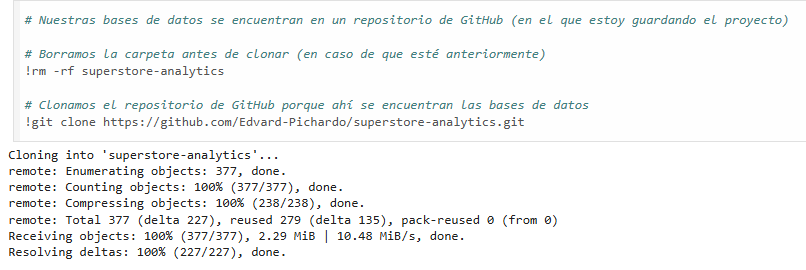
</p>

> **Nota:** en las dos views principales se eliminaron las comillas dobles (`"`) y las comas (`,`) de los nombres de producto, porque provocaban errores de lectura al importar el CSV en Python.

### Preparación y validación

El notebook carga los CSV (con `utf-8-sig` y *fallback* a `latin-1`), inspecciona la estructura, convierte tipos y genera un reporte de calidad por columna. Comprueba que no haya filas duplicadas y que los nulos restantes (`profit` 498, `sales` 468, `ship_mode` 280 y `quantity` 188 líneas) coincidan con lo dejado a propósito en SQL.

### Reproducción del análisis SQL

La intención no es repetir mecánicamente lo hecho en SQL, sino comprobar que pandas reconstruye los mismos resultados a partir de las views.

**Desempeño anual.** Las ventas y el beneficio no evolucionan de la mano:

| Año | Ventas | Beneficio | Margen | Ventas (interanual) | Beneficio (interanual) |
|:---:|---:|---:|:---:|:---:|:---:|
| 2023 | $469,226 | $28,528 | 6.08 % | n/a | n/a |
| 2024 | $449,335 | $32,924 | 7.33 % | −4.2 % | +15.4 % |
| 2025 | $556,829 | $17,502 | 3.14 % | +23.9 % | −46.8 % |
| 2026 | $681,386 | $67,934 | 9.97 % | +22.4 % | +288.2 % |

En 2024 las ventas bajaron y el beneficio subió; en 2025 ocurrió lo contrario. Vender más no garantiza ganar más. Con solo cuatro observaciones anuales, esta lectura es descriptiva y no una correlación estadística.

<p align="center">
  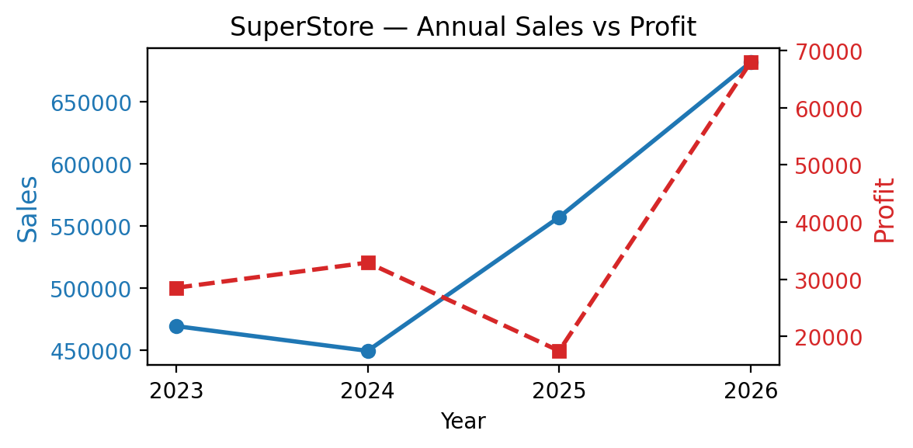
  <br>
  <em>Figura: Ventas contra ganancia por año.</em>
</p>

**Estacionalidad mensual (2023–2026).**

- **Temporada alta:** septiembre ($291.7k), noviembre ($327.5k) y diciembre ($313.6k) concentran el 43.3 % de las ventas totales. Aun así, el beneficio no escala: en noviembre el margen es de solo 0.68 %.
- **Temporada baja:** el primer trimestre, sobre todo enero ($89.5k) y febrero ($56.8k). Febrero es la caída más crítica: menos de la mitad del volumen de un mes de la meseta central.
- **Resto del año:** se mantiene estable (entre $130k y $185k por mes), con excepción de marzo ($180.9k), que presenta un salto abrupto. Ese bloque representa las ventas base del negocio.

<p align="center">
  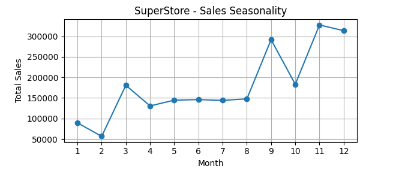
  <br>
  <em>Figura: Ventas totales por mes, 2023–2026.</em>
</p>

**Categorías y subcategorías.**

| Categoría | Ventas | Beneficio | Margen |
|---|---:|---:|:---:|
| Technology | $755,222 | $97,578 | 12.92 % |
| Furniture | $706,381 | −$20,903 | −2.96 % |
| Office Supplies | $695,173 | $70,213 | 10.10 % |

Cinco subcategorías operan con pérdidas: Tables (−$25,750; −13.1 %), Bookcases (−$13,979; −12.9 %), Machines (−$9,284; −5.4 %), Binders (−$5,915; −3.1 %) y Supplies (−$1,162; −2.7 %). En cambio, *Copiers* tiene un margen de 48 % y *Accessories* de 19 %. El déficit de *Furniture* se explica sobre todo por Tables y Bookcases, no por toda la categoría.

**Geografía.**

| Región | Ventas | Beneficio | Margen |
|---|---:|---:|:---:|
| West | $696,510 | $44,094 | 6.33 % |
| East | $645,367 | $53,178 | 8.24 % |
| Central | $448,164 | $28,701 | 6.40 % |
| South | $366,734 | $20,915 | 5.70 % |

Estados Unidos concentra el 98.7 % de las ventas (margen 6.75 %) y Canadá el 1.3 % (margen 11.27 %). A nivel de estado, California ($439k; 11.0 %) y Nueva York ($287k; 16.2 %) sostienen el beneficio, mientras que Texas ($152k; −16.9 %), Illinois, Pennsylvania, Ohio y Carolina del Norte (−41.9 %) venden con margen negativo.

**Logística.**

| Modo de envío | Pedidos | Margen | Días promedio |
|---|:---:|:---:|:---:|
| Standard Class | 56.9 % | 8.00 % | 4.99 |
| Second Class | 18.1 % | 3.07 % | 3.23 |
| First Class | 14.8 % | 7.78 % | 2.19 |
| Same Day | 4.8 % | 2.07 % | 0.04 |
| Desconocido | 5.4 % | 14.60 % | 3.97 |

Al cruzar región y modo de envío, los días de entrega son casi idénticos entre regiones. Lo que cambia es la rentabilidad: *Same Day* pierde dinero en East y South, y *Second Class* en West.

### Análisis exploratorio adicional

**Correlaciones.** Se estudian `Sales`, `Quantity`, `Discount`, `Profit` y `Shipping Days`. La relación más negativa es Descuento–Beneficio (−0.12); Ventas–Beneficio es positiva pero débil (0.09). La correlación se interpreta como asociación, no como causalidad, y al ser lineal no captura relaciones de otro tipo.

<p align="center">
  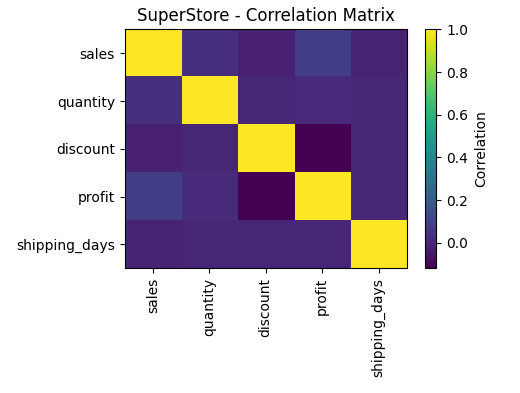
  <br>
  <em>Figura: Matriz de correlación entre las variables principales.</em>
</p>

**Descuento vs. beneficio.** Un scatter plot y bandas de descuento muestran en qué punto cambia la rentabilidad:

| Banda | Ventas | Beneficio | Margen |
|:---:|---:|---:|:---:|
| 0–10 % | $1,040,907 | $265,787 | 25.53 % |
| 10–20 % | $739,913 | $7,898 | 1.07 % |
| 20–30 % | $101,182 | −$18,277 | −18.06 % |
| 30–40 % | $120,918 | −$21,480 | −17.76 % |
| 40–50 % | $57,556 | −$21,459 | −37.28 % |
| 50 %+ | $96,300 | −$65,581 | −68.10 % |

<p align="center">
  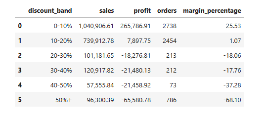
  <br>
  <em>Figura: Beneficio por banda de descuento.</em>
</p>

**Distribuciones** de `Sales`, `Profit`, `Quantity`, `Discount` y `Shipping Days`: las variables económicas son muy asimétricas, con una cola de pérdidas más larga que la de ganancias. Por eso se prefiere la mediana sobre la media.

<p align="center">
  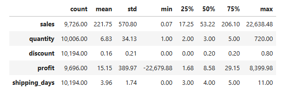
  <br>
  <em>Figura: Distribución de las variables principales.</em>
</p>

**Outliers.** Se detectan con el criterio IQR (`Q1 − 1.5 × IQR` y `Q3 + 1.5 × IQR`): 1,129 en `Sales`, 1,891 en `Profit` y 277 en `Quantity`. No se eliminan automáticamente, porque pueden ser pedidos estratégicos o pérdidas reales que merecen auditoría.

**Cuadrantes de productos.** Ventas vs. beneficio respecto a la mediana, con cuatro perfiles: alta venta / alto beneficio, alta venta / bajo beneficio, baja venta / alto beneficio y baja venta / bajo beneficio.

<p align="center">
  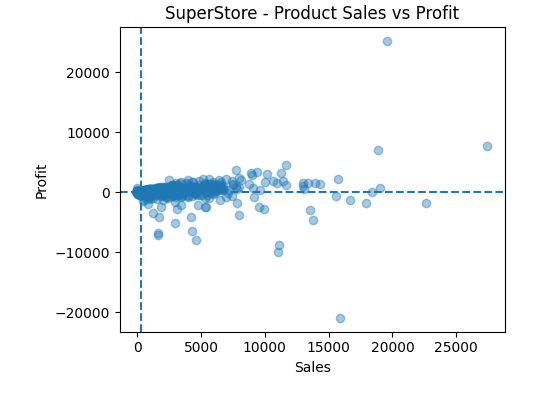
  <br>
  <em>Figura: Cuadrantes de ventas vs. beneficio.</em>
</p>

**RFM.** Segmentación descriptiva de clientes por *Recency*, *Frequency* y *Monetary*, con puntuaciones por cuartiles (1 a 4) y un puntaje agregado de 3 a 12. Se usa como análisis descriptivo, no como CLV predictivo.

<p align="center">
  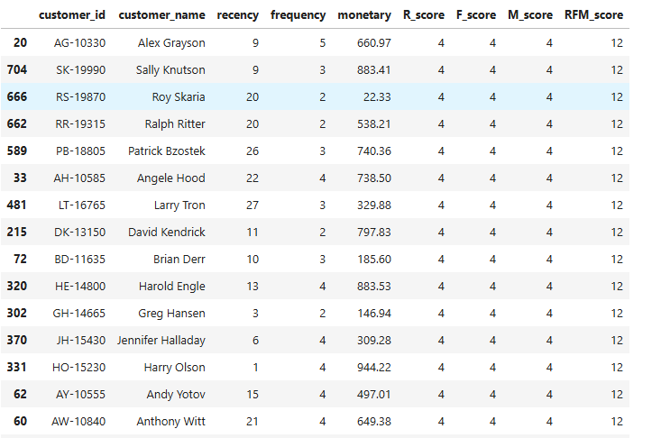
  <br>
  <em>Figura: Análisis RFM de la base de clientes.</em>
</p>

### Resumen de líderes y rezagados

| Dimensión | Hallazgo |
|---|---|
| Categoría líder por ventas | Technology |
| Categoría líder por beneficio | Technology |
| Categoría con peor beneficio | Furniture |
| Región líder por ventas | West |
| Producto líder por ventas | Fellowes PB500 Electric Punch Plastic Comb Binding Machine |
| Producto líder por beneficio | Canon imageCLASS 2200 Advanced Copier |
| Cliente líder por ventas | Sean Miller |
| Subcategoría líder por ventas | Phones |
| Subcategoría con peor beneficio | Tables |
| Modo de envío más utilizado | Standard Class |
| Modo de envío con mayor tiempo promedio | Standard Class |

Estos resultados ilustran el tipo de insights que permite obtener el proyecto; las conclusiones finales deben basarse en las tablas y gráficos completos del notebook.

---

## Power BI: dashboard

Como cierre del proyecto, los resultados se llevaron a un dashboard interactivo en Power BI, construido sobre las mismas dos views que usa Python: `vw_sales_detail` y `vw_order_summary`.

- Archivo: [`powerbi/superstore_dashboard.pbix`](powerbi/superstore_dashboard.pbix)
- Exportación en PDF, para quien no tenga Power BI Desktop: [Ver dashboard en PDF](powerbi/superstore_dashboard.pdf)

### Modelo de datos

Se construyó una tabla `Calendario` relacionada con `vw_order_summary` por `order_date`, y esta a su vez con `vw_sales_detail` por `order_key`. Un solo camino de filtros evita relaciones ambiguas dentro del modelo.

### Páginas

| Página | Contenido |
|---|---|
| **1. Resumen ejecutivo** | Ventas, beneficio, margen, pedidos y clientes, con evolución mensual y estacionalidad |
| **2. Productos y descuentos** | Reproduce de forma interactiva el hallazgo central: los descuentos altos generan pérdidas en la mayoría de las líneas de pedido |
| **3. Clientes y geografía** | Ventas por estado y desempeño por segmento de cliente |
| **4. Logística** | Días de envío por modo y región, con mapa de calor para detectar combinaciones lentas |

<p align="center">
  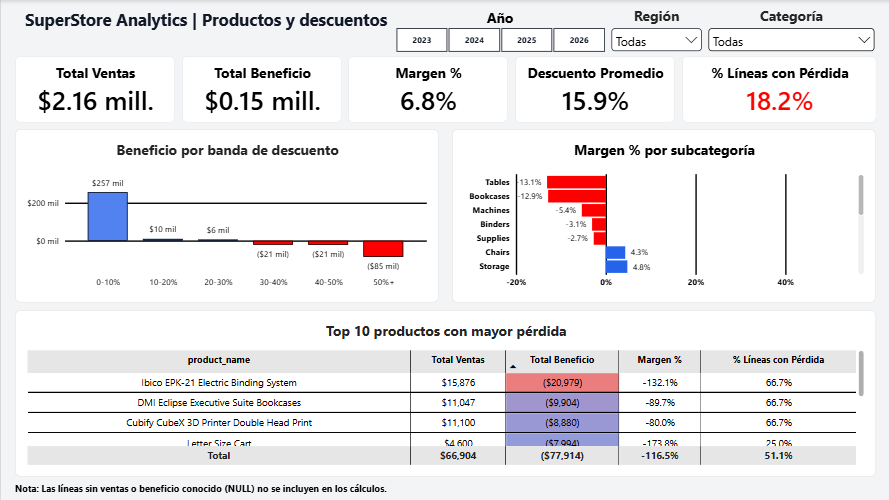
  <br>
  <em>Figura: Beneficio por banda de descuento y productos con mayor pérdida.</em>
</p>

<details>
<summary><b>Ver las otras páginas del dashboard</b></summary>

<br>

<p align="center">
  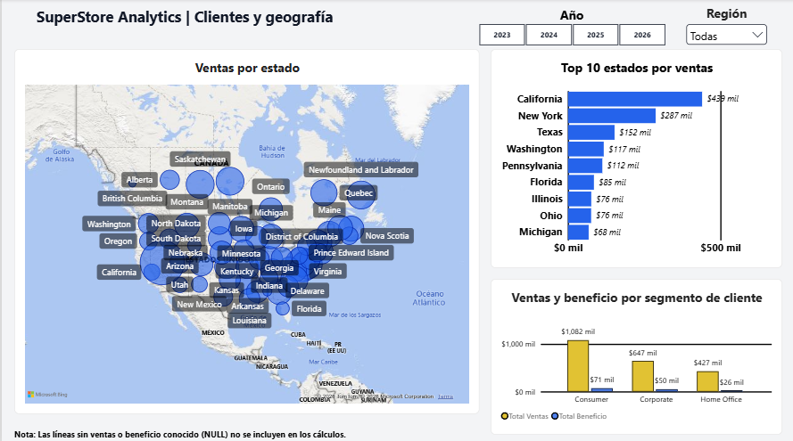
  <br>
  <em>Figura: Ventas por estado y por segmento de cliente.</em>
</p>

<p align="center">
  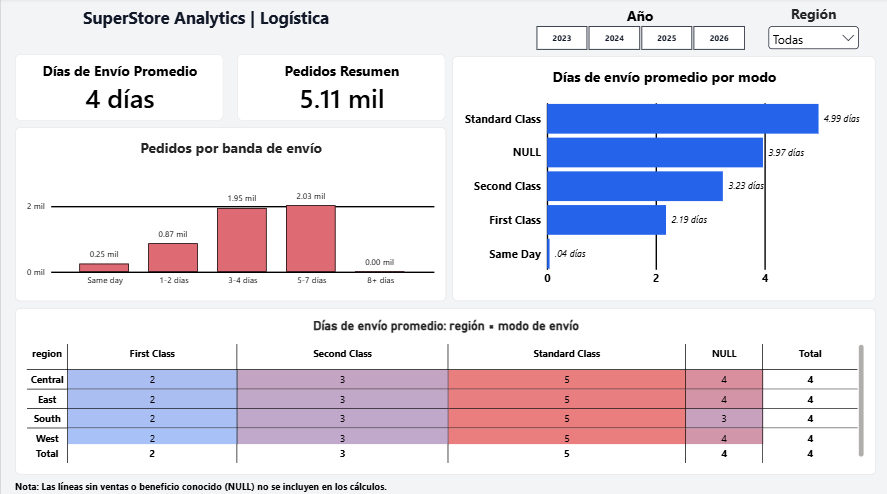
  <br>
  <em>Figura: Días de envío promedio por región y modo de envío.</em>
</p>

</details>

---

## Cómo reproducir el proyecto

### Requisitos

- MySQL 8.0+ y un cliente (MySQL Workbench o la extensión Database Client de VS Code)
- Python 3.10+ con `pandas`, `numpy` y `matplotlib` (o una cuenta de Google Colab)
- Power BI Desktop, solo para abrir el `.pbix`

### 1. SQL

Ejecuta las carpetas de `sql/` en orden numérico (1 → 6). Dentro de cada una, los archivos también están numerados. El orden general es:

1. Crear esquema
2. Crear tablas
3. Crear PK/FK/restricciones
4. Cargar datos (`data/raw/sales_superstore_raw.csv`)
5. Limpiar / normalizar (`04_data_cleaning_1` → `04_data_cleaning_7`)
6. Validar datos
7. Crear views
8. Ejecutar `analysis` (`01` → `09`)
9. Crear procedures (`01` → `06`)
10. Crear `audit_log`
11. Crear triggers (`01` → `06`)
12. Ejecutar la validación integral (`07_validate_audit_system`)

### 2. Python

1. Abre el notebook en Colab con el botón de arriba.
2. La primera celda clona el repositorio:
   ```python
   !git clone https://github.com/Edvard-Pichardo/superstore-analytics.git
   ```
3. `RUTA_BASE` apunta a `superstore-analytics/data/views/`.
4. Ejecuta las celdas en orden: carga de CSV, validación de estructura, análisis y visualizaciones.

### 3. Power BI

Abre `powerbi/superstore_dashboard.pbix` y, si cambias la ubicación de los CSV, actualiza la ruta de origen en *Transformar datos*.

---

## Decisiones de diseño y limitaciones

**Decisiones**

- **`NULL`:** los valores monetarios no recuperables con evidencia se dejaron vacíos, y toda la recuperación exigió una referencia única y no ambigua.
- **Clave sustituta `product_key`:** resuelve IDs de producto reutilizados.
- **Dos niveles de detalle** (línea y pedido) para no mezclar métricas.
- **Correlación no es causalidad,** y RFM se usa como análisis descriptivo, no predictivo.

**Limitaciones**

- Es un dataset público de práctica; los resultados no describen a una empresa real. Algunos productos presentan márgenes superiores al 100 % o inferiores al −100 %, lo que confirma que los datos no son totalmente consistentes con un negocio real.
- Los totales se calculan sobre valores conocidos: `Sales` tiene cobertura de 95.4 % de las líneas, `Profit` de 95.1 % y `Quantity` de 98.2 %. Los valores `NULL` restantes no se estiman.
- La recuperación de `Sales`, `Quantity` y `Profit` se basa en precios y márgenes de referencia, por lo que es una estimación y no un dato observado.
- Dos `order_id` (`CA-2023-131807` y `CA-2026-131807`) aparecen con dos ciudades y códigos postales distintos (Calgary y Edmonton). No hay evidencia suficiente para decidir cuál es el correcto, por lo que se conservaron sin modificar. Esto explica que haya 5,113 pedidos en `vw_order_summary` y 5,111 `order_id` distintos.
- Hay 280 pedidos sin modo de envío conocido que se agrupan como *Unknown* en el análisis logístico.
- La comparación anual se basa en solo cuatro años, así que las tendencias son descriptivas.
- El análisis es descriptivo; no incluye modelos predictivos.

---

## Tecnologías

| Área | Herramientas |
|---|---|
| Base de datos | MySQL 8, SQL, MySQL Workbench / VS Code Database Client |
| Análisis | Python, pandas, NumPy, matplotlib, Jupyter Notebook, Google Colab |
| BI | Power BI Desktop, DAX |
| Control de versiones | Git, GitHub |

---

## Autor y licencia

**Cristian Eduardo Pichardo Rico**

Egresado de la Licenciatura en Física, Facultad de Ciencias, UNAM
[LinkedIn](https://www.linkedin.com/in/edvard-pichardo) · GitHub: [@Edvard-Pichardo](https://github.com/Edvard-Pichardo)

Distribuido bajo la licencia **MIT**. Consulta el archivo [LICENSE](LICENSE) para más información.
